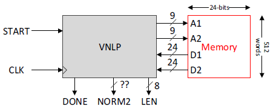
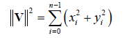
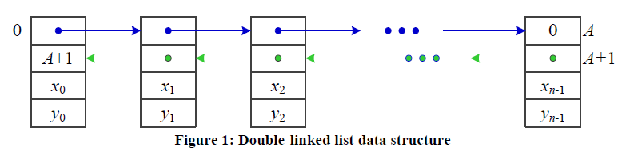
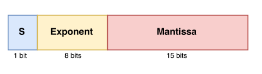
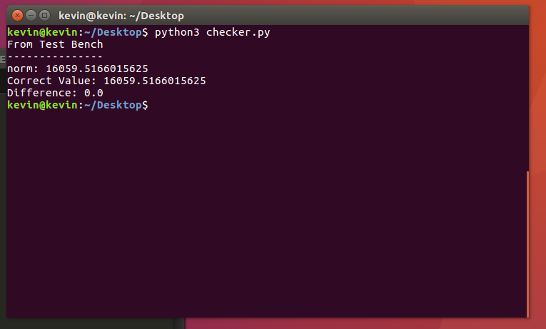
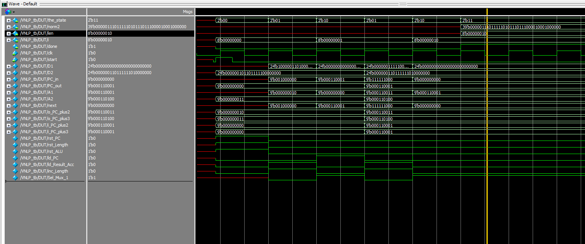

## Vector Norm List Processor
 

 

This is a **Verilog** implementation of a Vector Norm List Processor. The VNLP processor computes the L2 norm of an n-dimensional complex vector of the form v = x + iy. Recall that the L2 norm of a multidimensional vector is defined as follows:

 

## Details

The **x** and **y** values of the vector are stored in memory in the form of a doubly linked-list data structure shown below.

 

Each node in the list contains 4 words: the first two contain the next and previous pointers and the last two contain the x and y values. The first node in the list is stored at address 0 in memory, while the last node is stored at address A. There are 512 words in memory. Hence memory can contain at most 512/4 = 128 nodes, and therefore the maximum length of vectors supported in this design is 128. Also note that the maximum value of address A is 508.

Each word in memory is 24 bits wide. These bits are divided into 3 fields: the sign, the exponent and the mantissa. However note that since we are squaring the components of the vector when performing our calculations, the sign bit field can be ignored (the square of a number is always positive).

 

## File Hierarchy

    │----HDL
    │     │---- VNLP.v
    │     │---- Memory.v
    │     │---- ...
    │
    │---- Test_Benches
    │     │---- VNLP_tb.v
    │     │---- norm_adder_tb.v
    │     │---- ...
    │
    │---- Scripts
    
    
HDL contains the verilog code for each module used in the design of the code. For example, Datapath makes use of a multiplexor, a D flip-flop and hence, there is a separate Verilog code for each of those: **Mux_2ch.v**, **D_flop.v**, etc.

There isn't a test bench file for each module, rather the 2 most important units in the code and their associated submodules: the floating point unit **norm_adder** which contains 2 multipliers, 2 adders and a D flip-flop (for accumulating the norm).

Finally, **Scripts** contains the Python files which can be leveraged to quickly check test_benches and create 24 bit representations of any number the user would like to test. I'll be including a seperate README file for the python scripts in the future.
    
## Implementation

There are 4 main components that define the architecture of this design:

- **VNLP**: the top level block
- **Memory**: implements the memory block
- **Datapath**: implements the datapath
- **Control**: implements the controller

The **Datapath** consists of registers, control signals, multiplexors and a floating point unit capable of performing multiplication (squaring) and addition on its operands. 

Meanwhile, the **Processor** is in charge of the timing of all the activity of datapath. It is essentially an FSM with 4 states:

- **S_idle**: state entered after start is asserted. Registers are reset.
- **S_calc**: Perform the L2 norm calculation on the currently fetched vector. 
- **S_fetch**: fetch the address of the next node in the list using the next node field.
- **S_done**: state entered when the whole list has been traversed and the final length and norm have been calculated.

Note that the current design of the datapath is not fully optimized as a whole clock cycle is being wasted to fetch the address of the next node in the list. An optimized version is in progress...

## Scripts

I've included a few python scripts which help with reading the output of the verilog test bench and converting from the 24 bit floating point representation to a decimal number.

## Results

I put 2 nodes in the list with the following x and y values [-33.125, 23.75, 101.96875, 63.25]. That is, x_0 = -33.125, y_0 = 23.75, etc. I then use `converter.py` to quickly change these to their 24 bit floating point representation. For example, x_0 gets converted to `24'b1_00000110_100001001000000`.

I also need to change the addresses of next and previous to their 24 bit representation. Note in this case, since we need at most 9 bits to represent the maximum value of A, then by design, I choose to store the addresses in the mantissa part of the word. This is where `addresses.py` comes in handy and automates the process for me.

The correct answer for the L2 norm in this case is 16059.5166015625. To check if the result of the test bench is correct, I use `checker.py` which reads the last line of the test bench and parses the value of the norm. I've given it the correct value so it just checks against it and computes the difference (in case I'm testing for precision and effects of truncation).

For example, this is the output of running `checker.py` on the above values.

 

And here's a picture of the wavefrom generated by ModelSim.

 

